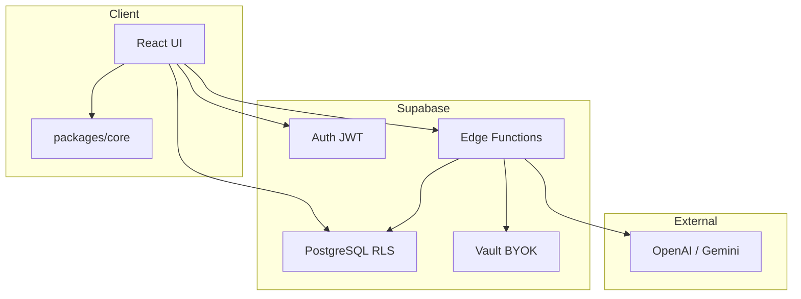
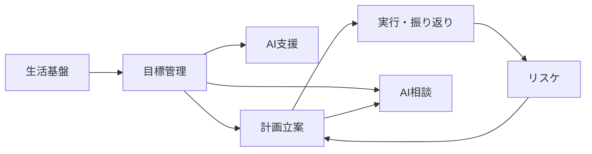

# AI秘書スケジュール管理アプリ

## 基本設計書

2026/5/24 初版

## 改訂履歴

| 版  | 日付       | 変更内容                         | 担当 |
| --- | ---------- | -------------------------------- | ---- |
| 1.0 | 2026-05-24 | 初版                             | —    |
| 1.1 | 2026-05-24 | システム概要に技術スタックを追加 | —    |
| 1.2 | 2026-05-24 | 用語定義に技術用語を追加         | —    |

---

## 目次

1. [はじめに](#はじめに)
2. [システム概要](#システム概要)
3. [機能設計](#機能設計)
4. [画面設計](#画面設計)
5. [インターフェース設計](#インターフェース設計)
6. [データ設計](#データ設計)
7. [レイヤー設計](#レイヤー設計)
8. [非機能設計](#非機能設計)

- [付録](#付録)

---

## はじめに

### 文書概要

本書は、AI秘書スケジュール管理アプリの **基本設計** を記述する。**システムがどのように構成されているか** を示す。

詳細は以下の分割文書に記載する。

| 分割文書                                                                    | 内容                     |
| --------------------------------------------------------------------------- | ------------------------ |
| [基本設計書\_画面設計.md](./基本設計書_画面設計.md)                         | 画面・ルート・遷移       |
| [基本設計書\_インターフェース設計.md](./基本設計書_インターフェース設計.md) | Edge Function・外部 API  |
| [基本設計書\_データ設計.md](./基本設計書_データ設計.md)                     | ER 図・データ状態        |
| [基本設計書\_テーブル設計.md](./基本設計書_テーブル設計.md)                 | テーブル・カラム定義     |
| [基本設計書\_レイヤー設計.md](./基本設計書_レイヤー設計.md)                 | 処理分担・モジュール構成 |

### 対象

- 本アプリの開発・保守を行うエンジニア
- 設計レビュー・セキュリティレビューを行う担当者

### 参考文書

| 文書                                                                          | 内容                       |
| ----------------------------------------------------------------------------- | -------------------------- |
| [詳細企画書](./AI秘書スケジュール管理アプリ_詳細企画書_セキュリティ反映版.md) | 機能要件・セキュリティ要件 |
| [技術選定と実装方針](./技術選定と実装方針.md)                                 | 技術スタック選定理由       |
| [AGENTS.md](../AGENTS.md)                                                     | コーディング規約           |

### 用語定義

#### ドメイン用語

| 用語           | 説明                                                         |
| -------------- | ------------------------------------------------------------ |
| 大機能         | ユーザーが認識する機能のまとまり（例: 生活基盤機能）         |
| 小機能         | 大機能に含まれる個別の操作・処理（例: 当日変更）             |
| 目標           | ユーザーが登録する長期目標                                   |
| 作業ブロック   | 日次スケジュールに配置される作業の単位                       |
| 仮スケジュール | 自動生成後、ユーザー承認前のスケジュール（`draft` 状態）     |
| リスケ         | 未達や遅延に応じて、今後の計画を組み直すこと                 |

#### 技術用語

本書および分割文書で繰り返し登場する技術用語を示す。

| 用語            | 説明                                                                                       |
| --------------- | ------------------------------------------------------------------------------------------ |
| Edge Function   | Supabase 上で動くサーバー側プログラム。AI 呼び出しやスケジュール生成など秘匿処理を担う     |
| Supabase        | 本アプリの基盤サービス。認証・DB・サーバーレス関数などを一体提供する BaaS                 |
| BaaS            | Backend as a Service。サーバー構築を省略し、認証・DB 等をクラウドサービスとして利用する方式 |
| SPA             | Single Page Application。ページ遷移時に画面全体を再読み込みせず、1 枚の Web アプリとして動作する構成 |
| PWA             | Progressive Web App。ブラウザからホーム画面追加など、アプリに近い体験を提供する Web アプリ   |
| JWT             | JSON Web Token。ログイン後に発行される認証トークン。API 呼び出し時に本人確認に使う         |
| RLS             | Row Level Security。PostgreSQL の行単位アクセス制御。ログインユーザー自身のデータのみ読み書き可能にする |
| PostgREST       | Supabase が提供する REST API。クライアントから DB テーブルを直接 CRUD する際に利用する     |
| Vault           | Supabase の機密情報保管機能。AI 用 API キーを暗号化して保存する                           |
| BYOK            | Bring Your Own Key。ユーザー自身が AI プロバイダの API キーを登録し、利用する方式          |
| API キー        | OpenAI や Gemini 等の外部 AI サービスを呼び出すための秘密鍵。本アプリでは Vault に保存する |
| マイグレーション | DB スキーマ（テーブル・制約等）をバージョン管理する SQL ファイル。`supabase db push` で適用 |
| packages/core   | `@ai-scheduler/core` パッケージ。空き時間計算や Zod スキーマなど、UI に依存しない共有ロジック |
| Zod             | TypeScript 向けのスキーマ検証ライブラリ。フォーム入力や AI 出力の形式チェックに使う       |
| CRUD            | Create / Read / Update / Delete。データの作成・読み取り・更新・削除の基本操作              |
| CI              | Continuous Integration。コード変更時に型チェックやテストを自動実行する仕組み（GitHub Actions） |

## システム概要

### 目的

本アプリは長期目標・生活リズム・固定予定をもとに、日々の行動計画を **自動生成・調整** する AI 秘書型スケジュール管理 Web アプリである。作業に明確化および最適な時間配分の設定を目的とする。

### システム全体構成



### 技術スタック

本アプリで採用している主要技術を以下に示す。選定理由の詳細は [技術選定と実装方針](./技術選定と実装方針.md) を参照。

| 区分           | 技術                            | 用途                                                      |
| -------------- | ------------------------------- | --------------------------------------------------------- |
| 言語           | TypeScript 5                    | フロント・Edge Function・共有ロジックの統一               |
| フロントエンド | React 19, Vite 6                | SPA / PWA 向け UI                                         |
| スタイリング   | Tailwind CSS 4                  | 画面レイアウト・コンポーネントスタイル                    |
| ルーティング   | React Router v7                 | 画面遷移・タブナビ                                        |
| サーバー状態   | TanStack Query v5               | Supabase データの取得・キャッシュ・更新                   |
| フォーム       | React Hook Form, Zod            | 入力バリデーション（クライアント・サーバー共通スキーマ）  |
| 日時処理       | date-fns                        | タイムゾーンを含む日付・時刻計算                          |
| 共有ロジック   | `@ai-scheduler/core`            | 空き時間計算、Zod スキーマ、DB 型（フレームワーク非依存） |
| BaaS           | Supabase                        | Auth（JWT）、PostgreSQL、RLS、Vault                       |
| サーバーレス   | Supabase Edge Functions（Deno） | AI 呼び出し、スケジュール生成、データエクスポート等       |
| AI プロバイダ  | OpenAI, Google Gemini           | 目標分解・リスケ・相談（BYOK、Edge Function 経由）        |
| モノレポ       | pnpm workspaces, Turborepo      | `apps/web`, `packages/core`, `supabase/` の一元管理       |
| テスト         | Vitest                          | 共有ロジックのユニットテスト                              |
| CI             | GitHub Actions                  | 型チェック・テストの自動実行                              |

**実行環境**: Node.js 20 以上、pnpm 10 以上。

## 機能設計

機能は **大機能**（ユーザーが認識するまとまり）と、その中の **小機能**（個別の操作・処理）の 2 階層で整理する。

### 機能一覧

大機能の一覧。各項目に含まれる小機能名を併記する。

| 大機能             | 説明                                                         | 含む小機能                                                                           |
| ------------------ | ------------------------------------------------------------ | ------------------------------------------------------------------------------------ |
| 生活基盤機能       | 生活リズム・固定予定を整備し、今日の予定と空き時間を把握する | 初回設定、基本設定、生活リズム管理、固定予定管理、当日変更、ホーム表示、空き時間計算 |
| 目標管理機能       | 長期目標を登録・編集し、達成状況を確認する                   | 目標登録、目標編集・削除、進捗確認                                                   |
| AI 支援機能        | AI による目標分解・計画相談および AI 利用設定を行う          | AI 目標分解、AI 設定、AI 相談                                                        |
| 計画立案機能       | 週次の時間配分と日次の作業予定を自動生成する                 | 週次時間予算、アラート表示、日次スケジュール生成、スケジュール承認                   |
| 実行・振り返り機能 | 予定どおり実行したかを記録し、1 日を振り返る                 | 完了記録、振り返り                                                                   |
| リスケ機能         | 未達や遅延に応じて計画を組み直す                             | 小規模リスケ、大規模リスケ                                                           |
| 設定・データ権機能 | 通知プライバシーとデータのエクスポート・削除を管理する       | 通知プライバシー設定、データエクスポート、アカウント削除                             |
| 基盤機能           | ログインとデータアクセスの保護を担う                         | 認証、アクセス制御                                                                   |

### 機能概要

各機能について処理フローを記述する。

---

#### 生活基盤機能

生活基盤機能では、起床・就寝・食事・仕事など「毎日のルーティン」を登録し、今日の予定と使える空き時間をユーザーに示す。日次スケジュール生成の入力データとなる。

##### 初回設定

初回設定では、本アプリ初回起動時に起床・就寝時刻を登録する。
登録後、ホーム画面に遷移する。

##### 基本設定

基本設定では、ユーザーごとにスケジュール計算の前提条件を設定する。
ユーザー入力により、以下の項目を設定する。

- 平日および休日の起床・就寝時刻
- 1回あたりの作業可能時間
- 集中しやすい時間帯

##### 生活リズム管理

生活リズム管理では、ユーザーごとに生活リズムを設定する。
ユーザー入力により、以下の項目を設定する。

- 生活リズム種類
- ラベル
- 希望時刻
- 所要時間
- 許容幅
- 適用日

ユーザーによる保存指示により、生活リズムを保存する。

##### 固定予定管理

固定予定管理では、原則動かすことのできない予定を設定する。
設定した予定は空き時間計算から除外する。
ユーザー入力により、以下の項目を設定する。

- 予定タイトル
- 開始・終了時刻
- 移動時間
- 曜日

ユーザーによる保存指示により、固定予定を保存する。

##### 当日変更

当日変更では、当日の生活リズムの設定を変更する。
ユーザー入力により、以下の項目を変更する。

- 変更対象
  - 起床・就寝時間
  - 生活リズム
- 変更内容
  - スキップ
- 新しい時刻
- 所要時間

ユーザーによる保存指示により、当日の生活リズム変更を保存する。

##### ホーム表示

ホーム表示では、今日の作業・生活予定および空き時間を表示する。

##### 空き時間計算

空き時間計算では、当日の作業に利用できる時間を計算する。
起床から就寝までの時刻から、生活リズムおよび固定予定として設定されているブロックを差し引き、
計算した結果をホーム表示に反映する。

---

#### 目標管理機能

目標管理機能では、ユーザーが取り組む長期目標を登録・管理する。
AI による分解を承認した目標のみ、時間予算の計算および日次スケジュール生成の対象となる。

##### 目標登録

目標登録では、新規の長期目標を登録する。
ユーザー入力により、以下の項目を設定する。

- 目標名
- カテゴリ
- 達成期限
- 現状
- 達成条件
- 優先度
- 週あたりの利用可能時間
- 避けたい時間帯

ユーザーによる保存指示により、目標を保存する。
保存直後の目標は下書き状態となり、AI 分解の承認後に有効化される。

##### 目標編集・削除

目標編集・削除では、登録済み目標の内容を変更または削除する。
目標詳細画面から各項目を修正し、保存指示により反映する。
不要な目標は削除指示により削除する。

##### 進捗確認

進捗確認では、目標一覧および目標詳細画面において、目標の状態と進捗を表示する。
完了記録のたびに、目標全体の完了時間が更新される。

---

#### AI 支援機能

AI 支援機能では、ユーザー自身が登録した API キーを用いて AI を利用する。
目標の分解および計画に関する相談を行う。
AI の出力はユーザーが内容を確認・承認するまで確定保存されない。

##### AI 目標分解

AI 目標分解では、登録済み目標を AI が構成要素および作業ブロックに分解する。
分解結果はプレビューとして表示され、ユーザーが内容を確認する。
ユーザーによる承認指示により、分解結果を保存し、目標を有効化する。
1 日あたりの実行回数には上限がある。

##### AI 設定

AI 設定では、AI 利用に必要な設定を行う。
ユーザー入力により、以下の項目を設定する。

- AI プロバイダ（OpenAI / Gemini）
- モデル
- API キー
- AI の口調

接続テスト成功後、API キーは暗号化して保存する。
画面にはキーの末尾 4 桁のみ表示する。

##### AI 相談

AI 相談では、登録済みの目標・時間予算・直近の予定を踏まえ、計画について AI と対話する。
ユーザーがメッセージを送信すると、AI が応答を返す。
会話履歴はブラウザのセッション内のみ保持する。
1 日あたりの実行回数および月間トークン数には上限を設けられる。

---

#### 計画立案機能

計画立案機能では、有効化された目標に対し、週単位の時間配分と日単位の作業予定を自動生成する。
生成結果は仮の予定として提示され、ユーザーが承認した時点で確定する。

##### 週次時間予算

週次時間予算では、目標ごとに今週必要な作業時間と、実際に割り当て可能な時間を計算する。
ユーザーの「予算を再計算」指示により、以下を算出する。

- 今週の空き時間合計
- 目標ごとの必要時間
- 目標ごとの割当時間
- 達成見込みの状態

複数目標がある場合、優先度および期限に基づき時間を按分する。
時間が不足する場合は警告を生成する。

##### アラート表示

アラート表示では、時間不足や目標達成の困難が予想される場合に、ユーザーへ警告を表示する。
ホーム画面および時間予算画面で未読のアラートを確認できる。
通知プライバシー設定により、警告の詳細を伏せ字表示に切り替えられる。

##### 日次スケジュール生成

日次スケジュール生成では、指定日（通常は当日）の空き時間に、目標の作業ブロックを自動配置する。
生活基盤のデータ、週次時間予算、作業ブロックのテンプレートをもとに配置候補をスコアリングし、最適な順序で配置する。
固定予定との衝突や、起床・就寝時間の範囲外となる配置は行わない。
生成結果は仮スケジュールとして保存する。

##### スケジュール承認

スケジュール承認では、自動生成された仮スケジュールの内容をユーザーが確認する。
ユーザーによる承認指示により、予定を確定し、ホーム画面の作業予定に反映する。
内容に問題がある場合、再生成またはキャンセルが可能である。

---

#### 実行・振り返り機能

実行・振り返り機能では、承認済みの作業予定の実行結果を記録し、1 日の振り返りを行う。
記録内容は目標の進捗および翌日以降の計画生成に反映される。

##### 完了記録

完了記録では、当日配置された各作業ブロックについて、実行結果を記録する。
ユーザー入力により、以下を設定する。

- 完了状態（完了 / 一部達成 / 未達成）
- 実績時間

ユーザーによる保存指示により、作業ブロックの状態を更新する。
あわせて、目標全体および週次時間予算の完了時間を加算する。
当日の全ブロックが記録済みとなった場合、当日のスケジュールを完了状態とする。

##### 振り返り

振り返りでは、1 日の終わりに体調・所感を記録する。
ユーザー入力により、以下を設定する。

- 疲労度（1〜5）
- 振り返りメモ

ユーザーによる保存指示により、当日のスケジュールに振り返り内容を保存する。
疲労度は翌日のスケジュール生成時の配置判断に利用される。
過去 14 日分の振り返り履歴を閲覧できる。

---

#### リスケ機能

リスケ機能では、未達や遅延が発生した場合に、計画を組み直す。
変更内容はユーザーが確認・承認した時点で反映される。

##### 小規模リスケ

小規模リスケでは、未完了の作業ブロックを、翌日から 7 日後までの空き時間へ再配置する。
AI は使用せず、空き時間の探索および再配置を自動で行う。
再配置結果は仮スケジュールとして提示され、ユーザーが承認すると確定する。
元の作業ブロックは再配置済みとして更新される。

##### 大規模リスケ

大規模リスケでは、目標達成が大幅に遅れている場合、AI が週次時間予算の調整案を提示する。
調整案はプレビューとして表示され、ユーザーによる承認指示により、目標ごとの割当時間を更新する。
1 日あたりの実行回数には上限がある。

---

#### 設定・データ権機能

設定・データ権機能では、通知のプライバシー設定および、個人データのエクスポート・削除を行う。

##### 通知プライバシー設定

通知プライバシー設定では、アラート通知の表示方法を設定する。
ユーザー入力により、以下を切り替える。

- アラート詳細の表示可否
- Web Push 通知の有効化（将来対応）

詳細表示を OFF にした場合、アラート本文を伏せ字で表示する。

##### データエクスポート

データエクスポートでは、ユーザーに紐づく全データを JSON 形式でダウンロードする。
目標・予定・設定など、本アプリに保存されたデータを一括出力する。
API キー本体は含めない。

##### アカウント削除

アカウント削除では、ユーザーの全データおよび認証情報を完全に削除する。
削除前に確認ダイアログを表示し、ユーザーの同意を得たうえで実行する。
保存済みの API キーもあわせて削除する。操作は取り消せない。

---

#### 基盤機能

基盤機能では、全機能共通のログインおよびデータアクセスの保護を担う。
ユーザー向けの専用画面は持たない。

##### 認証

認証では、アプリ起動時にユーザーを識別し、セッションを維持する。
以降のデータ読み書きおよびサーバー処理の呼び出しは、認証済みユーザーのみ実行できる。

##### アクセス制御

アクセス制御では、ログインユーザー自身のデータのみ読み書き可能とする。
データベース層で行単位のアクセス制限を設け、他ユーザーのデータへのアクセスを防ぐ。

---

### 機能とルート・Edge Function の対応

| 機能               | 画面                                                                                 | Edge Function                                                        |
| ------------------ | ------------------------------------------------------------------------------------ | -------------------------------------------------------------------- |
| 生活基盤機能       | `/`, `/onboarding`, `/settings/preferences`, `/settings/routines`, `/settings/fixed` | —                                                                    |
| 目標管理機能       | `/goals/*`                                                                           | —                                                                    |
| AI 支援機能        | `/goals/:id/decompose`, `/settings/ai`, `/chat`                                      | `goal-decompose`, `goal-approve-decompose`, `ai-settings`, `ai-chat` |
| 計画立案機能       | `/budget`, `/schedule/approve`                                                       | `budget-calculate`, `schedule-generate`                              |
| 実行・振り返り機能 | `/review`                                                                            | —                                                                    |
| リスケ機能         | `/review`, `/schedule/approve`                                                       | `schedule-reschedule-minor`, `reschedule-major`                      |
| 設定・データ権機能 | `/settings/notifications`, `/settings/data`                                          | `export-data`, `delete-account`                                      |
| 基盤機能           | （全画面共通）                                                                       | （JWT 検証は各 Edge Function）                                       |

### 機能間依存関係



- 目標が `active` でないと計画立案（予算・日次生成）の対象にならない
- 計画立案は生活基盤の空き時間データに依存する
- リスケ（大規模）承認は `goal_budgets.allocated_minutes` の上書きを伴う

---

## 画面設計

画面・ルート・ナビゲーション・画面遷移については、[基本設計書\_画面設計.md](./基本設計書_画面設計.md) を参照。

---

## インターフェース設計

Edge Function・PostgREST・外部 API については、[基本設計書\_インターフェース設計.md](./基本設計書_インターフェース設計.md) を参照。

---

## データ設計

ER 図・データ状態の概要は [基本設計書\_データ設計.md](./基本設計書_データ設計.md) を参照。

テーブルおよびカラム定義の詳細は [基本設計書\_テーブル設計.md](./基本設計書_テーブル設計.md) を参照。

---

## レイヤー設計

処理分担・モジュール構成については、[基本設計書\_レイヤー設計.md](./基本設計書_レイヤー設計.md) を参照。

---

## 非機能設計

### 可用性

本アプリは Supabase（Auth / PostgreSQL / Edge Functions）を BaaS として利用する。
サーバーレス構成とし、Edge Function は JWT と DB のみに依存するステートレス設計とする。

### 拡張性

ドメインロジックは `packages/core` に集約し、Client と Edge Function から共有する。
新機能追加時は core にロジックを置き、UI は hooks を通じて薄く保つ。

Phase 追加時は `packages/core` にロジックを先に置き、マイグレーション・mapper を同時に更新する。

### 運用・保守性

モノレポ（pnpm workspaces + Turborepo）で `apps/web`、`packages/core`、`supabase/functions` を一元管理する。

CI（GitHub Actions）では core のビルド・ユニットテスト（32 件）および web の型チェックを自動実行する。

`packages/core` の変更後に Edge Function をデプロイする場合は、事前に `pnpm --filter @ai-scheduler/core build` を実行する。

### セキュリティ

全 public テーブルで RLS を有効化し、本人データのみアクセス可能とする。

AI 用 API キーは Vault に暗号化保存し、Client には末尾 4 桁のみ表示する。
AI 出力および仮スケジュールはユーザー承認後にのみ DB へ反映する。

AI 呼び出しは日次回数上限および月間トークン上限（任意設定）で制限する。
AI 呼び出しログにはマスキング済み要約のみ保存する。

---

## 付録

### ディレクトリ構成

```text
ai_scheduler/
├── AGENTS.md
├── README.md
├── apps/web/
│   └── src/
│       ├── pages/            # 16 画面
│       ├── components/
│       ├── hooks/            # useScheduleData, useGoals, useBudgets, ...
│       └── lib/              # supabase, query-keys, edge-functions
├── packages/core/
│   └── src/
│       ├── scheduling/
│       ├── ai/
│       ├── schemas/
│       ├── mappers/
│       └── database-types.ts
├── supabase/
│   ├── migrations/           # Phase 1〜5
│   └── functions/            # 10 Edge Functions + _shared
└── docs/
```

### 運用・保守

環境構築および保守運用の手順は以下を参照。

デプロイ前の必須コマンド:

```bash
pnpm --filter @ai-scheduler/core build
supabase db push
supabase functions deploy <function-name>
```
