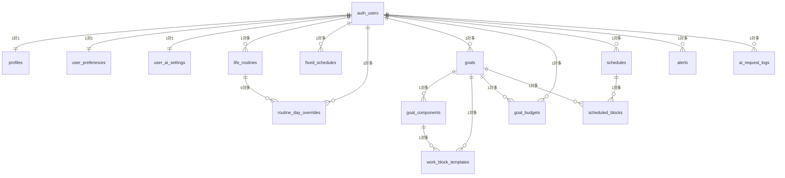
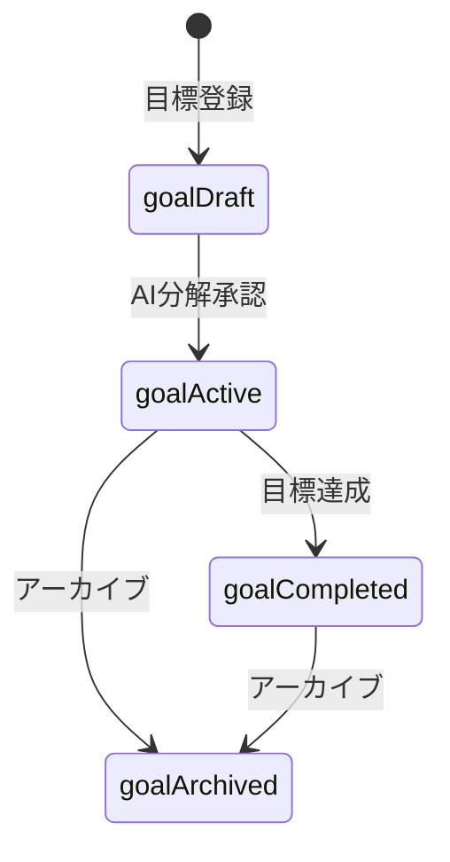

# データ設計

> 親文書: [基本設計書.md](./基本設計書.md)  
> カラム定義: [基本設計書_テーブル設計.md](./基本設計書_テーブル設計.md)  
> 型定義: [`packages/core/src/database-types.ts`](../packages/core/src/database-types.ts)  
> マイグレーション: [`supabase/migrations/`](../supabase/migrations/)

本書は、本アプリが保持するデータの全体像（ER 図・状態遷移）を記述する。
テーブルおよびカラムの詳細は [基本設計書_テーブル設計.md](./基本設計書_テーブル設計.md) を参照。

---

## テーブル一覧

| テーブル | 説明 | 主な関連大機能 |
| --- | --- | --- |
| `profiles` | ユーザーの表示名・タイムゾーン | 基盤 |
| `user_preferences` | 起床就寝・作業上限・通知設定 | 生活基盤 / 設定・データ権 |
| `life_routines` | 生活リズム（食事・風呂等） | 生活基盤 |
| `fixed_schedules` | 固定予定（仕事・通学等） | 生活基盤 |
| `routine_day_overrides` | 当日変更 | 生活基盤 |
| `goals` | 長期目標 | 目標管理 |
| `goal_components` | 目標の構成要素 | 目標管理 / AI 支援 |
| `work_block_templates` | 作業ブロックのテンプレート | AI 支援 / 計画立案 |
| `user_ai_settings` | AI プロバイダ・Vault 参照・口調 | AI 支援 |
| `ai_request_logs` | AI 呼び出しログ | AI 支援 |
| `goal_budgets` | 週次時間予算 | 計画立案 |
| `schedules` | 日次スケジュール・振り返り | 計画立案 / 実行・振り返り |
| `scheduled_blocks` | 配置済み作業ブロック | 計画立案 / 実行・振り返り |
| `alerts` | 警告 | 計画立案 |

---

## ER 図（全体）

---

## 主要データの状態

### 目標（goals）

| 状態 | 意味 |
| --- | --- |
| 下書き | 登録直後。AI 分解前 |
| 有効 | AI 分解承認済み。予算・日次生成の対象 |
| 完了 | 目標達成 |
| アーカイブ | 手動でアーカイブ |

### 日次スケジュール（schedules）

| 状態 | 意味 |
| --- | --- |
| 下書き | 自動生成直後。未承認 |
| 承認済み | ユーザー承認済み |
| 進行中 | 一部完了記録あり |
| 完了 | 当日の記録・振り返り完了 |
| キャンセル | ユーザーがキャンセル |

### 作業ブロック（scheduled_blocks）

| 状態 | 意味 |
| --- | --- |
| 予定 | 配置済み・未記録 |
| 完了 | 完了記録済み |
| 一部達成 | 一部のみ完了 |
| スキップ | 未達成として記録 |
| 再配置済み | 小規模リスケで移動 |

---

## データと画面の対応

| 画面操作 | 主な書き込み先 |
| --- | --- |
| 初回設定・基本設定 | `user_preferences` |
| 生活リズム CRUD | `life_routines` |
| 固定予定 CRUD | `fixed_schedules` |
| 当日変更 | `routine_day_overrides` |
| 目標登録・編集 | `goals` |
| AI 分解承認 | `goal_components`, `work_block_templates`, `goals` |
| 予算再計算 | `goal_budgets`, `alerts` |
| 日次生成 | `schedules`, `scheduled_blocks` |
| スケジュール承認 | `schedules` |
| 完了記録 | `scheduled_blocks`, `goals`, `goal_budgets` |
| 振り返り | `schedules` |
| 通知設定 | `user_preferences.notification_settings` |

---

## アクセス制御

全 public テーブルで Row Level Security（RLS）を有効化する。
原則として、ログインユーザー自身の行のみ読み書き可能とする。

API キーの本体は DB テーブルには保存せず、Vault に暗号化保存する。
`user_ai_settings` には Vault への参照と末尾 4 桁のみ保持する。
