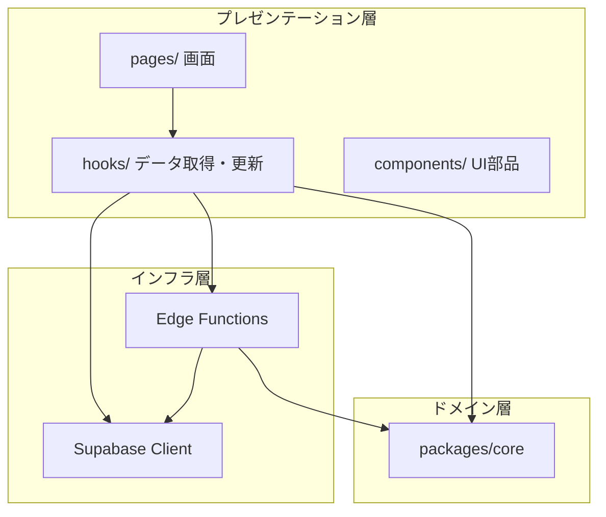

# レイヤー設計

> 親文書: [基本設計書.md](./基本設計書.md)

本書は、処理の実行場所とモジュール分担を記述する。

---

## レイヤー構成



---

## プレゼンテーション層（apps/web）

画面表示およびユーザー操作を担当する。

### 画面（pages）

ルートごとに 1 画面コンポーネントを配置する。
画面は hooks 経由でデータを取得し、直接 DB ロジックを持たない。

### フック（hooks）

関心ごとにデータ取得・更新を集約する。

| Hook | 担当領域 |
| --- | --- |
| `useScheduleData` | 生活リズム、固定予定、基本設定、当日変更 |
| `useGoals` | 目標、AI 設定、AI 分解 |
| `useBudgets` | 時間予算、アラート |
| `useSchedules` | 日次スケジュール生成・承認 |
| `useExecution` | 完了記録、振り返り、リスケ |
| `useChat` | AI 相談 |
| `usePhase5` | 通知設定、振り返り履歴 |
| `useDataRights` | エクスポート、削除 |

Edge Function 呼び出しは `lib/edge-functions.ts` に集約する。
Query Key は `lib/query-keys.ts` に集約する。

---

## ドメイン層（packages/core）

フレームワーク非依存のビジネスロジックを担当する。
Client と Edge Function の双方から利用する。

### scheduling（非 AI スケジューリング）

| モジュール | 役割 |
| --- | --- |
| `free-time.ts` | 空き時間計算 |
| `overrides.ts` | 当日変更の適用 |
| `block-builders.ts` | 生活ブロックの構築 |
| `weekly-free-time.ts` | 週合計空き時間 |
| `budget.ts` | 週次時間予算の按分 |
| `scoring.ts` | 配置候補のスコアリング |
| `placement.ts` | 貪欲法による配置 |
| `validation.ts` | 衝突・範囲の検証 |
| `execution.ts` | 完了記録・進捗加算 |
| `reschedule-minor.ts` | 小規模リスケ |

### ai（AI 入出力）

| モジュール | 役割 |
| --- | --- |
| `prompts/` | プロンプト構築 |
| `schemas/` | AI 出力の Zod スキーマ |
| `normalize-*.ts` | プロバイダ差異の正規化 |

### schemas / mappers

フォーム入力および DB 行の Zod スキーマ、DB 行からドメイン型への変換を担当する。

---

## インフラ層

### Supabase Client（Client 側）

認証済み JWT を用いて PostgREST 経由で CRUD を行う。
単純な読み書きは Client から直接実行する。

### Edge Functions（サーバー側）

以下の処理をサーバー側で実行する。

- AI 呼び出し（API キー復号を含む）
- 週次予算計算、日次スケジュール生成、小規模リスケ
- データエクスポート、アカウント削除

重いロジックおよび改ざん防止が必要な処理を担う。

---

## 処理分担の原則

| 処理の種類 | 実行場所 |
| --- | --- |
| 生活データ・目標の CRUD | Client → Supabase |
| ホーム画面の空き時間表示 | Client（core 利用） |
| 週次予算・日次生成・リスケ | Edge Function（core 利用） |
| AI 分解・相談・大規模リスケ | Edge Function |
| 承認・完了記録 | Client → Supabase |

---

## スケジューリング処理の流れ

```text
生活データ + 固定予定 + 当日変更
        ↓
   空き時間計算
        ↓
   週次時間予算按分
        ↓
   スコアリング → 配置 → 検証
        ↓
   仮スケジュール（ユーザー承認）
        ↓
   実行記録 → 振り返り
        ↓
   リスケ（必要時）
```
