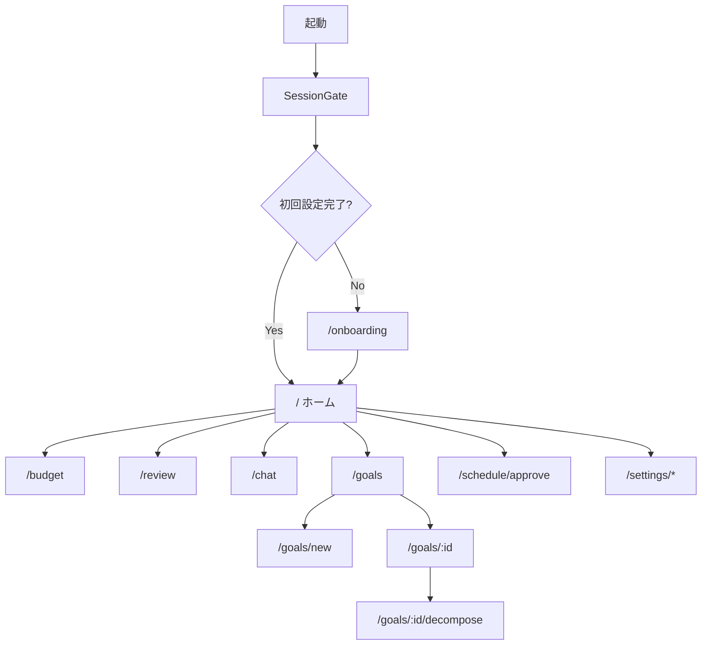

# 画面設計

> 親文書: [基本設計書.md](./基本設計書.md)  
> ルート定義の正: [`apps/web/src/App.tsx`](../apps/web/src/App.tsx)

本書は、各画面の目的・主要操作・画面間の遷移を記述する。

---

## 画面一覧

| ルート | 画面名 | 所属大機能 |
| --- | --- | --- |
| `/onboarding` | 初回設定 | 生活基盤 |
| `/` | ホーム | 生活基盤 |
| `/settings/preferences` | 基本設定 | 生活基盤 |
| `/settings/routines` | 生活リズム | 生活基盤 |
| `/settings/fixed` | 固定予定 | 生活基盤 |
| `/goals` | 目標一覧 | 目標管理 |
| `/goals/new` | 目標登録 | 目標管理 |
| `/goals/:id` | 目標詳細 | 目標管理 |
| `/goals/:id/decompose` | AI 分解確認 | AI 支援 |
| `/settings/ai` | AI 設定 | AI 支援 |
| `/chat` | AI 相談 | AI 支援 |
| `/budget` | 時間予算 | 計画立案 |
| `/schedule/approve` | スケジュール承認 | 計画立案 |
| `/review` | 振り返り | 実行・振り返り / リスケ |
| `/settings/notifications` | 通知設定 | 設定・データ権 |
| `/settings/data` | データ管理 | 設定・データ権 |

---

## 画面概要

### 初回設定（`/onboarding`）

初回設定画面では、本アプリ初回利用時に起床・就寝時刻を入力する。
入力完了後、ホーム画面へ遷移する。
初回設定が未完了の場合、他画面へは進めない。

### ホーム（`/`）

ホーム画面では、今日の生活予定・作業予定・空き時間を一覧表示する。
当日の生活リズム変更、アラート確認、承認待ちスケジュールへの導線を提供する。

### 基本設定（`/settings/preferences`）

基本設定画面では、起床・就寝時刻、作業上限、集中しやすい時間帯を変更する。

### 生活リズム（`/settings/routines`）

生活リズム画面では、食事・風呂などの定例イベントを登録・編集・削除する。
希望時刻は「ごろ」入力とし、許容幅は自動計算する。

### 固定予定（`/settings/fixed`）

固定予定画面では、仕事・通学など曜日固定の予定を登録・編集・削除する。

### 目標一覧（`/goals`）

目標一覧画面では、登録済み目標を状態別に表示する。
新規目標登録画面および目標詳細画面へ遷移できる。

### 目標登録（`/goals/new`）

目標登録画面では、新規目標の各項目を入力して保存する。

### 目標詳細（`/goals/:id`）

目標詳細画面では、目標の内容・進捗を表示する。
編集および AI 分解確認画面への遷移が可能である。

### AI 分解確認（`/goals/:id/decompose`）

AI 分解確認画面では、AI による分解結果のプレビューを表示する。
ユーザーが内容を確認し、承認指示により目標を有効化する。

### AI 設定（`/settings/ai`）

AI 設定画面では、プロバイダ・モデル・API キー・口調を設定する。
接続テスト後、キーを暗号化保存する。

### AI 相談（`/chat`）

AI 相談画面では、目標・予算・予定を踏まえ AI とチャット形式で対話する。

### 時間予算（`/budget`）

時間予算画面では、目標ごとの今週の必要時間・割当時間・達成見込みを表示する。
予算の再計算指示を受け付ける。

### スケジュール承認（`/schedule/approve`）

スケジュール承認画面では、自動生成された仮スケジュールを確認する。
承認・キャンセル・再生成の操作が可能である。
ナビゲーションには表示しない（フロー誘導専用）。
クエリ `?date=` により対象日を指定できる。

### 振り返り（`/review`）

振り返り画面では、作業ブロックの完了記録、疲労度・メモの入力、小規模/大規模リスケの実行、振り返り履歴の閲覧を行う。

### 通知設定（`/settings/notifications`）

通知設定画面では、アラート詳細の表示可否および Web Push 有効化フラグを設定する。

### データ管理（`/settings/data`）

データ管理画面では、全データの JSON エクスポートおよびアカウント削除を行う。

---

## ナビゲーション

### デスクトップ

左サイドバー（幅 240px）に以下 11 項目を表示する。

ホーム、時間予算、振り返り、AI 相談、目標、基本設定、生活リズム、固定予定、AI 設定、通知、データ管理

### モバイル

下部タブに主要 5 項目を表示する。

ホーム、時間予算、振り返り、AI 相談、目標

---

## 画面遷移（概要）

